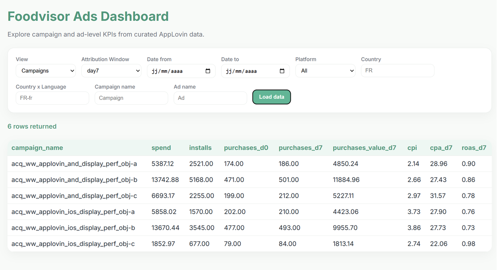
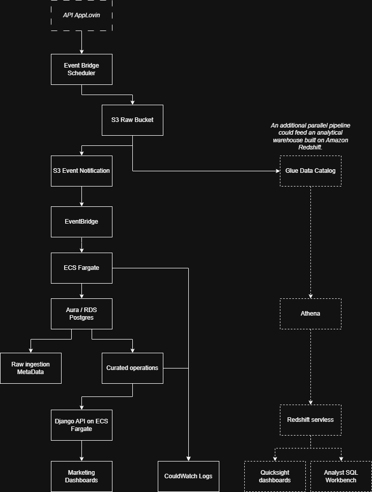

# Foodvisor - Data Engineer Technical Test

## Overview

This project implements a marketing data pipeline for processing AppLovin advertising performance data used by Foodvisor's marketing team.

It was developed as part of a technical assessment for a Data Engineer role, focusing on data ingestion, historical tracking, data curation, and analytical API development.

The objective is to:
- Ingest CSV produced by AppLovin API (d0, d7, d30)
- Maintain curated datasets containing the latest known values.
- Expose aggregated KPIs through a REST API.
- Demonstrate a production-oriented architecture suitable for AWS deployment.
- Bonus: develop a simple user interface that consumes the API

## Assumptions

The following assumptions were made during implementation:

- CSV files are immutable once delivered.
- Attribution windows (`day0`, `day7`, `day30`) represent independent snapshots of campaign performance.
- A business key is defined by:
  - date
  - platform
  - country_x_language
  - campaign_id
  - ad_id
- The curated layer must always expose the latest known state for a business key.
- Reprocessing older files must never overwrite more recent data.

## Tech Stack
- Python
- Django
- Django REST Framework
- PostgreSQL
- Docker Compose

## Project Structure
```
foodvisor-data-engineer-test/
├── data/
|   ├── source/         # Input CSV files provided with the challenge
├── app/
|   ├── api/            # Rest framework
|   ├── models/         # Django ORM 
|   ├── services/       # Core business logic
|   ├── dashboard/      # Serve the User Interface
|   ├── management/
|   |   ├── commands/   # Python instructions to launch sepcific operations
├── foodvisor_ads/      # Django configuration
├── templates/          # Html templates
```

## Running with Docker Compose

Start the full local environment:

```bash
docker compose up --build
```

This starts:

* PostgreSQL database
* Django application server
* Database migrations are applied automatically at startup

The application is available at:

```text
http://localhost:8000
```

---

## Data Ingestion

Once the containers are running, ingest all CSV files from the default data directory:

```bash
docker compose exec web python manage.py ingest_directory
```

By default, this command reads files from:

```text
../data/source
```

To reset all ingested and curated data:

```bash
docker compose exec web python manage.py reset_data
```

To ingest a single file:

```bash
docker compose exec web python manage.py ingest_file ../data/source/2022-06-01_day0_anon.csv
```

The ingestion process is idempotent. Re-ingesting the same file will not duplicate raw or curated records.

---

## API Examples

Campaign-level KPIs:

```text
http://localhost:8000/api/campaigns
```

Campaign-level KPIs for the `day7` attribution window:

```text
http://localhost:8000/api/campaigns?attribution_window=day7
```

Ad-level KPIs:

```text
http://localhost:8000/api/ads
```

Ad-level KPIs for a specific attribution window:

```text
http://localhost:8000/api/ads?attribution_window=day30
```

Filter by date range:

```text
http://localhost:8000/api/campaigns?date_from=2022-06-01&date_to=2022-06-03
```

Filter by platform:

```text
http://localhost:8000/api/campaigns?attribution_window=day7&platform=iOS
```

Filter by country:

```text
http://localhost:8000/api/campaigns?attribution_window=day7&country=FR
```

Combined filters:

```text
http://localhost:8000/api/ads?attribution_window=day7&date_from=2022-06-01&date_to=2022-06-03&platform=iOS&country=FR
```

Supported query parameters:

* `date_from`
* `date_to`
* `attribution_window`
* `platform`
* `country`
* `country_x_language`
* `campaign_name`
* `ad_name`

---

## Dashboard Interface

A lightweight dashboard is available at:

```text
http://localhost:8000/dashboard/
```

The dashboard allows users to:

* select campaign or ad-level views
* choose the attribution window
* filter by date range
* filter by platform, country, campaign, and ad
* inspect aggregated KPIs in a table




## Idempotency

The pipeline computes a SHA-256 hash for each source file.

If a file with the same content has already been processed, ingestion is skipped automatically.

This guarantees that running the ingestion multiple times does not create duplicate records.

## Storage Layers
### FileIngestion

Stores ingestion metadata and lineage information.

### RawAdsRow

Stores the original AppLovin performance records exactly as received from the source files.

This layer is append-only and serves as the system of record for all ingested data.

## Latest State Resolution

Multiple files may contain information about the same campaign or ad across different extraction dates.

When a record already exists in the curated layer, it is only updated if the incoming extraction date is more recent than the stored version.

This guarantees that the curated layer always exposes the latest known state regardless of ingestion order.

## Limitations

### Curated Upsert Strategy

The current implementation relies on Django ORM row-by-row upserts.For each business key (`date`, `platform`, `country_x_language`, `campaign_id`, `ad_id`), the pipeline verifies whether a curated record already exists and only updates it when the incoming extraction is more recent than the stored version.

This approach was intentionally chosen because it guarantees correctness regardless of ingestion order. For example, if an older extraction is ingested after a newer one, the pipeline preserves the latest known state.

The main drawback of this implementation is performance. Row-by-row upserts generate a large number of database queries and become increasingly expensive as data volumes grow.

Several optimization options were considered:

#### Bulk Upserts with Django ORM

Django provides support for bulk upserts through `bulk_create(update_conflicts=True)`.

This approach significantly improves ingestion performance by reducing the number of database round-trips. However, it cannot easily express the business rule requiring updates only when the incoming `last_extraction_date` is more recent than the existing one. As a result, an older extraction could potentially overwrite a newer version if files are ingested out of order.

#### PostgreSQL Native Upserts

A production-grade implementation would leverage PostgreSQL native upserts:

```sql
INSERT ...
ON CONFLICT (...)
DO UPDATE
WHERE excluded.last_extraction_date >= target.last_extraction_date;
```
This approach provides both correctness and high performance by executing updates in bulk while preserving the latest-state guarantee. I would implement it if i had time, but I prefere to stay in the context of ORM for this test.

### Future Enhancements

Current limitation: 
- Curated upsert is implemented row by row for clarity. For production-scale ingestion, this should be replaced by a bulk upsert strategy using PostgreSQL ON CONFLICT or a staging table.
- The curated layer only stores the latest state for a given business key. Historical versions are preserved in the raw layer through extraction snapshots, but the curated layer does not currently expose a ready-to-use history layer.
- The API currently returns all matching records in a single response. Pagination should be introduced for larger datasets to improve scalability and response times.
- Authentication and authorization are intentionally omitted for simplicity. A production deployment should protect endpoints using IAM, API Gateway, OAuth2, JWT, or another appropriate authentication mechanism.
- Basic indexing has been implemented for the most common filtering dimensions. Additional optimization may be required as data volumes grow, including partitioning, clustering, or dedicated analytical storage structures.
- The pipeline performs basic validation but does not currently implement advanced data quality monitoring. Future enhancements could include: Schema validation, Volume anomaly detection, KPI consistency validation, Automated alerting
- Testing coverage is currently limited; a production-ready implementation should include comprehensive unit, integration, API, and regression tests to validate ingestion, idempotency, attribution routing, curated upserts, and end-to-end data consistency.

## Target AWS Architecture

### Overview

The proposed architecture combines scheduled and event-driven ingestion patterns to support both automated AppLovin extractions and manual backfill operations.

Raw files are stored in Amazon S3 to ensure auditability, replayability, and long-term historical retention. Curated datasets are maintained in PostgreSQL and exposed through a Django REST API for operational consumption.

Analytical workloads are separated from application workloads through a dedicated analytics layer based on Amazon Redshift and Amazon QuickSight.



### EventBridge Scheduler

Amazon EventBridge Scheduler triggers periodic extraction jobs according to the required attribution windows (day0, day7, day30).

This mechanism automates data collection from the AppLovin API and removes the need for manual execution.

---

### ECS Fargate Extraction Tasks

Extraction jobs are executed as ECS Fargate tasks.

Using Fargate allows the ingestion logic to reuse the existing Django management commands without managing servers or EC2 instances.

---

### Amazon S3 Raw Storage

Raw CSV files are stored in an immutable S3 bucket.

This storage layer provides:

* historical retention
* replayability
* auditability
* recovery from ingestion failures
* support for future backfills

---

### Event-Driven Ingestion

Whenever a new file is uploaded to the raw S3 bucket, an S3 Event Notification is emitted. The notification is routed through EventBridge, which launches an ECS Fargate ingestion task. This event-driven architecture decouples file production from file processing and naturally supports manual uploads and future data sources.

---

### Aurora PostgreSQL

Aurora PostgreSQL stores operational datasets used by the application.

Two types of information are maintained:
* ingestion metadata
* curated marketing datasets

Aurora serves as the operational data store powering the API layer.

---

### Django REST API

The Django API exposes campaign-level and ad-level KPIs through HTTP endpoints.

The API is intended for:

* internal applications
* operational reporting
* lightweight integrations
* external consumers requiring programmatic access

Keeping the API layer allows the platform to satisfy operational use cases independently from analytical workloads.
Django REST API is hosted on ECS Fargate.

The Django REST API is maintained to satisfy operational and programmatic access requirements defined in the exercise. In a production environment focused exclusively on business intelligence and reporting, Amazon QuickSight could consume curated datasets directly through Redshift, reducing the need for a dedicated API layer.

However, the API remains valuable for integrations, internal tools, automation workflows, and external consumers requiring machine-to-machine access.

---

### Redshift Serverless

Amazon Redshift Serverless acts as the analytical warehouse.

Curated operational datasets can be replicated into Redshift to support:

* large aggregations
* historical analysis
* marketing reporting
* self-service analytics

This separation prevents analytical workloads from impacting operational API performance.

---

### Amazon QuickSight

Amazon QuickSight provides business intelligence dashboards for marketing stakeholders.

QuickSight connects directly to Redshift and enables:

* KPI monitoring
* campaign performance analysis
* marketing reporting
* executive dashboards

Business users interact with QuickSight rather than querying operational systems directly.

---

### Monitoring

CloudWatch collects logs and metrics from both ingestion tasks and API services.

This enables centralized monitoring, troubleshooting, and alerting.

---

### Architectural Principles

The architecture follows several key principles:

* Raw and curated layers are clearly separated.
* Ingestion is event-driven whenever possible.
* Operational and analytical workloads are isolated.
* Raw data remains replayable at all times.
* Business users consume dashboards through QuickSight.
* Applications consume data through the REST API.
* Infrastructure remains serverless or fully managed whenever possible.


# Author

Guillaume Blot

Data Engineer | Analytics | Data Products

This project was developed as part of a technical assessment for a Data Engineer position and demonstrates the implementation of a reproducible and auditable marketing data ingestion pipeline.

GitHub: https://github.com/datanostra